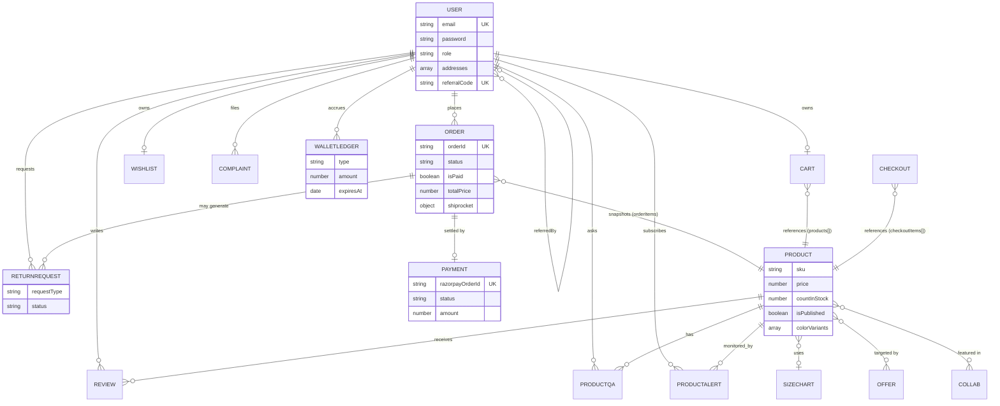
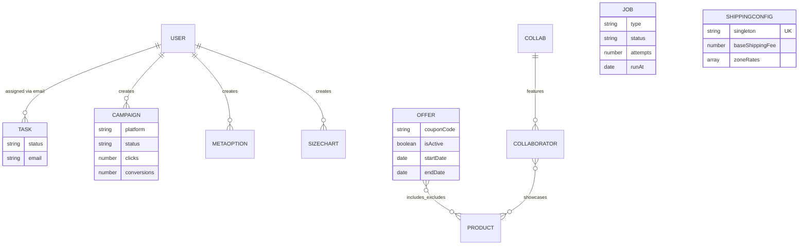

# DATABASE STRUCTURE DOCUMENT

## Raphaaa – Role-Based Full-Stack E-Commerce and Business Operations Platform

**Document Version:** 1.0
**Database Engine:** MongoDB (document store), accessed via Mongoose ODM
**Prepared From:** All 28 schemas in `backend/models/*.js` (current codebase snapshot)
**Companion Documents:** `RAPHAAA_SYSTEM_DESIGN.md`, `RAPHAAA_DFD.md`, `RAPHAAA_SRS.md`

> **Rendering note:** Diagrams are Mermaid code — render on GitHub/GitLab/VS Code (Markdown Preview Mermaid Support extension) or at https://mermaid.live.

---

## 1. Overview

Raphaaa uses a single MongoDB database with **28 collections**, defined as Mongoose schemas. The design favors:
- **Embedding** for data that is always accessed together and doesn't need independent querying (e.g., `Order.orderItems`, `User.addresses`, `Product.colorVariants`).
- **Referencing** (`ObjectId` + `ref`) for data with independent lifecycle or many-to-many relationships (e.g., `Order.user → User`, `Review.product → Product`).
- **Snapshotting** for financial/historical integrity — `Order.orderItems` copies `name`, `price`, `image` at time of purchase rather than referencing live `Product` fields, so historical orders remain accurate even if the product is later edited or deleted.
- **Singleton documents** for global configuration (`ShippingConfig` uses a unique `singleton: "global"` field to guarantee exactly one config document).

## 2. Collection Inventory

| # | Collection | Model File | Purpose |
|---|---|---|---|
| 1 | `users` | `User.js` | Accounts, roles, addresses, referral, OTP/verification |
| 2 | `products` | `Product.js` | Catalog items, variants, pricing, SEO, compliance fields |
| 3 | `carts` | `Cart.js` | Per-user/guest shopping cart |
| 4 | `checkouts` | `Checkout.js` | Checkout session (current) |
| 5 | `checkout1s`* | `Checkout1.js` | Checkout session (legacy/alternate variant) |
| 6 | `orders` | `Order.js` | Confirmed purchase records, fulfilment & shipping state |
| 7 | `payments` | `payment.js` | Razorpay transaction records |
| 8 | `reviews` | `Review.js` | Product ratings/reviews |
| 9 | `wishlists` | `Wishlist.js` | Saved-for-later products per user |
| 10 | `offers` | `offer.js` | Promotions/coupons with a rule engine |
| 11 | `campaigns` | `campaignModel.js` | Marketing campaign tracking |
| 12 | `tasks` | `taskModel.js` | Internal staff task assignment |
| 13 | `subscribers` | `Subscriber.js` | Newsletter subscribers |
| 14 | `contacts` | `Contact.js` | Contact-form submissions |
| 15 | `contactsettings` | `ContactSetting.js` | Site-wide contact/social/legal settings (singleton-style) |
| 16 | `complaints` | `complaintModel.js` | Customer complaints |
| 17 | `heroes` | `Hero.js` | Legacy single hero banner content |
| 18 | `heroslides` | `HeroSlide.js` | Ordered homepage hero carousel slides |
| 19 | `abouts` | `About.js` | About Us page content |
| 20 | `policies` | `policyModel.js` | Privacy Policy / legal page content |
| 21 | `metaoptions` | `MetaOption.js` | Configurable catalog attribute values (category/collection/gender/material) |
| 22 | `collabs` | `Collab.js` | Collaboration/exclusive-drop showcases |
| 23 | `returnrequests` | `ReturnRequest.js` | Return/replace workflow and reverse-logistics tracking |
| 24 | `sizecharts` | `SizeChart.js` | Reusable size chart templates |
| 25 | `productqas` | `ProductQA.js` | Product Q&A threads |
| 26 | `productalerts` | `ProductAlert.js` | Back-in-stock / price-drop subscriptions |
| 27 | `walletledgers` | `WalletLedger.js` | Wallet credit/debit/expiry audit trail |
| 28 | `jobs` | `Job.js` | Background job queue (emails, webhooks, stock sync) |
| 29 | `shippingconfigs` | `ShippingConfig.js` | Global shipping fee/zone configuration (singleton) |

\* `Checkout1` appears to be a parallel/alternate schema to `Checkout` (near-identical, missing the `pricing` breakdown field) — likely a migration-in-progress artifact worth consolidating.

---

## 3. Detailed Schema Reference

### 3.1 `User`
| Field | Type | Constraints |
|---|---|---|
| name | String | required |
| email | String | required, unique, validated |
| password | String | required, hashed (bcrypt pre-save hook), min length 6 |
| role | String enum | `customer` \| `admin` \| `merchantise` \| `delivery_boy` \| `marketing`; default `customer` |
| photo | String | default "" |
| addresses[] | embedded Address[] | firstName, lastName, address, landmark, city, state, postalCode, country, phone, addressType (`Home`/`Work`/`Other`), isDefault |
| coupon | embedded object | code, discount, expiresAt |
| mobile / mobileVerified | String / Boolean | OTP verification flag |
| pushSubscription | embedded object | Web Push endpoint + keys |
| referralCode | String | unique, sparse |
| referredBy | ObjectId → User | self-referencing |
| referralCount | Number | default 0 |
| otpCode / otpExpires | String / Date | OTP verification |
| resetToken / resetTokenExpire | String / Date | password reset |
| recentlyViewed[] | embedded [{product → Product, viewedAt}] | personalization |

### 3.2 `Product`
| Field | Type | Constraints |
|---|---|---|
| name, description, price | String/String/Number | conditionally required if `isPublished !== false` |
| discountPrice, offerPercentage | Number | manual discount fields |
| baseDiscountPrice, baseOfferPercentage | Number | pre-sale baseline pricing |
| activeSaleOfferId | ObjectId → Offer | currently applied sale |
| activeSalePrice, activeSaleOfferPercentage, activeSaleSyncedAt | Number/Number/Date | synced sale-price cache |
| countInStock, sku, category, brand | Number/String/String/String | catalog core fields |
| sizes[], colors[] | [String] | flat legacy facets |
| colorVariants[] | embedded [{color, colorName, images[], sizes[{size, sku, countInStock}]}] | current structured variant system |
| variants[] | embedded (legacy) [{designName, color, size, sku, countInStock}] | kept for backward compatibility |
| collections, material, gender | String | catalog facets |
| images[] | [{url, altText}] | product gallery |
| sizeChart | embedded {templateId → SizeChart, imageUrl, measureImageUrl, title, audience} | |
| isFeatured, isPublished | Boolean | publish/feature flags |
| rating, numReviews | Number | denormalized review aggregate |
| tags[] | [String] | |
| externalOffers[] | [{provider enum, url, label}] | marketplace comparison links |
| deliveryPromise, returnPolicy | embedded objects | PDP trust content |
| trustBadges[] | [String] | |
| draftState | Mixed | unpublished draft form cache |
| user | ObjectId → User | creator/owner |
| metaTitle/metaDescription/metaKeywords | String | SEO |
| dimensions, weight | embedded/Number | logistics |
| freeShipping, extraShippingCharge | Boolean/Number | per-product shipping override |
| mrp, countryOfOrigin, materialComposition, washCare, netQuantity, manufacturerInfo | String/Number | India legal compliance fields |
| **Indexes** | | weighted text index (name/description/brand/category/collections/material/tags); compound indexes on `(isPublished, category)`, `(isPublished, brand)`, `(isPublished, price)`, `(isPublished, gender)` |

### 3.3 `Cart`
| Field | Type |
|---|---|
| user | ObjectId → User (optional — supports guest carts) |
| guestId | String |
| products[] | embedded [{productId → Product, name, image, price, size, color, sku, quantity}] |
| totalPrice | Number, required, default 0 |

### 3.4 `Checkout` / `Checkout1`
| Field | Type |
|---|---|
| user | ObjectId → User, required |
| checkoutItems[] | embedded [{productId → Product, name, image, price, quantity, size, color, sku}] |
| shippingAddress | embedded {address, city, postalCode, country} |
| paymentMethod, totalPrice | String/Number, required |
| pricing | Mixed (discount/shipping/offer breakdown) — **`Checkout` only, absent in `Checkout1`** |
| isPaid, paidAt, paymentStatus, paymentDetails | payment progress fields |
| isFinalized, finalizedAt | conversion-to-Order flag |

### 3.5 `Order`
| Field | Type |
|---|---|
| orderId | String, unique, auto-generated (6-char hex) via `pre("validate")` hook |
| user | ObjectId → User (optional — supports guest checkout) |
| guestEmail, guestName, orderNote | String |
| orderItems[] | embedded snapshot [{productId → Product, name, image, price, size, color, quantity, sku}] |
| shippingAddress | embedded {address, city, postalCode, country, phone} |
| paymentMethod, totalPrice | String/Number, required |
| walletApplied | Number, min 0 |
| couponSnapshot | embedded {codes[], appliedOffers[], personalCouponApplied, personalCouponCode, totalDiscount} |
| isPaid, paidAt, isDelivered, deliveredAt | Boolean/Date |
| paymentStatus, paymentResult | String / embedded {id, status, update_time, email_address} |
| status | enum: Processing, Packed, Transfer, Pickup Scheduled, Picked Up, Shipped, In Transit, Out For Delivery, Delivered, RTO Initiated, RTO Delivered, Refunded, Cancelled |
| shiprocket | embedded {shipmentId, shiprocketOrderId, awbCode, courierName, trackingStatus, trackingStatusCode, trackingUpdatedAt, channel, lastSyncAt, rawTracking} |
| cancellation | embedded {isCancelledByUser, reason, cancelledAt} |
| refundTimeline | embedded {status enum(none/initiated/processed/completed), initiatedAt, processedAt, completedAt, expectedDate, note} |
| idempotencyKey | String, indexed, sparse |

### 3.6 `Payment`
| Field | Type |
|---|---|
| orderId | ObjectId → Order, required |
| userId | ObjectId → User, required |
| razorpayOrderId | String, required, unique |
| razorpayPaymentId, razorpaySignature | String |
| amount, currency | Number/String, required |
| status | enum: created, captured, failed, refunded |
| failureReason, capturedAt, failedAt | payment lifecycle detail |
| refundId, refundReason, refundedAt | refund detail |
| idempotencyKey | String, unique, sparse, indexed |

### 3.7 `Review`
| Field | Type |
|---|---|
| product | ObjectId → Product, required |
| user | ObjectId → User, required |
| rating, comment | Number/String, required |
| image[] | [String] |
| isVerifiedPurchase | Boolean, default true |

### 3.8 `Wishlist`
| Field | Type |
|---|---|
| user | ObjectId → User, required, **unique** (one wishlist per user) |
| products[] | [ObjectId → Product] |

### 3.9 `Offer`
| Field | Type |
|---|---|
| title, description | String |
| images[], bannerImage, alertImage | media fields |
| priority, stackable, exclusiveGroup, couponCode | promo-engine controls |
| conditions | embedded {minCartSubtotal, newUserOnly, paymentMethods[], includeProductIds[]→Product, excludeProductIds[]→Product, includeCategories[], includeBrands[]} |
| benefit | embedded {scope enum(product/cart/shipping), type enum(percent/flat/free_shipping), percent, amount, maxDiscount} |
| startDate, endDate, isActive | promo validity window |
| offerPercentage, productIds[] | legacy fields (backward compatibility) |
| **Indexes** | `(isActive, startDate, endDate, priority)`; `couponCode` sparse |

### 3.10 `Campaign`
| Field | Type |
|---|---|
| name, platform enum(Google/Instagram/Facebook) | String |
| utmLink, startDate, endDate, budget | tracking setup |
| status | enum: Draft, Active, Paused, Completed |
| clicks, conversions, impressions | Number counters |
| createdBy | ObjectId → User |
| ctr, conversionRate | **virtual** getters (computed, not stored) |

### 3.11 `Task`
| Field | Type |
|---|---|
| name, email, title, description | String, required (assignee name/email + task detail) |
| status | enum: working, completed, not completed (default working) |

### 3.12 `Subscriber`
| Field | Type |
|---|---|
| email | String, required, unique, lowercase |
| ipAddress | String |
| isSubscribed | Boolean, default true |
| subscribedAt | Date |
| pushSubscription | embedded {endpoint, keys{auth, p256dh}} |

### 3.13 `Contact`
| Field | Type |
|---|---|
| name, email, subject, message | String, all required |

### 3.14 `ContactSetting` (site-wide singleton-style settings)
| Field | Type |
|---|---|
| show/url pairs for Facebook, Instagram, Twitter, Gmail, Phone | Boolean + String |
| showTopText, topText | announcement bar |
| socialLinks[] | [{platform, label, url, enabled}] |
| gstin, cin, businessName, registeredAddress | legal/business identity |
| grievanceOfficerName/Email, grievanceResponseTime | consumer-protection compliance |
| whatsappNumber | String |
| exitIntentCoupon, exitIntentDiscount, exitIntentEnabled | exit-intent popup config |

### 3.15 `Complaint`
| Field | Type |
|---|---|
| orderId | String, required |
| complaintType | enum: Damaged Product, Missing Item, Wrong Product Delivered, Late Delivery, Other |
| description | String, required |
| images[] | [String] |
| status | enum: Pending, Resolved, Rejected |
| user | ObjectId → User, required |

### 3.16 `Hero` (legacy single banner)
| Field | Type |
|---|---|
| title | String, required |
| paragraph, image | String |
| isVisible | Boolean, default true |

### 3.17 `HeroSlide` (current carousel system)
| Field | Type |
|---|---|
| image, title | String, required |
| badge, subtitle, description | String |
| ctaText, ctaLink, ctaSecondaryText, ctaSecondaryLink | CTA config |
| textAlign, contentPosition, overlayDirection, overlayColor | layout/styling enums |
| isVisible, order | Boolean/Number |

### 3.18 `About`
| Field | Type |
|---|---|
| content | String, required |

### 3.19 `Policy`
| Field | Type |
|---|---|
| content | String, required |

### 3.20 `MetaOption`
| Field | Type |
|---|---|
| type | enum: category, collection, gender, material |
| value | String, required, unique |
| createdBy | ObjectId → User |

### 3.21 `Collab`
| Field | Type |
|---|---|
| title, description, image | String, required |
| isPublished | Boolean |
| collaborators[] | embedded [{name, image, products[]→Product}] |

### 3.22 `ReturnRequest`
| Field | Type |
|---|---|
| order | ObjectId → Order, required, indexed |
| user | ObjectId → User, required, indexed |
| requestType | enum: return, replace |
| status | enum: requested, approved, rejected, pickup_scheduled, picked_up, in_transit_to_warehouse, received_at_warehouse, replacement_dispatched, replacement_delivered, refund_completed |
| reason, damageType, damageDescription | String |
| items[] | embedded [{orderItemId, productId → Product, name, quantity, sku, price, reason}] |
| evidenceImages[] | [String] |
| policyWindowDays, policyDeadlineAt | eligibility window |
| shiprocketReverse | embedded reverse-logistics tracking (mirrors `Order.shiprocket`) |
| adminNote, expectedResolutionDate | String/Date |
| timeline[] | embedded [{status, note, at, by → User}] audit trail |

### 3.23 `SizeChart`
| Field | Type |
|---|---|
| name, audience | String, required |
| chartImageUrl | String, required |
| measureImageUrl | String |
| unit | enum: in, cm |
| isActive | Boolean |
| createdBy | ObjectId → User, required |

### 3.24 `ProductQA`
| Field | Type |
|---|---|
| product | ObjectId → Product, required, indexed |
| user, guestName | ObjectId → User / String |
| question | String, required |
| answers[] | embedded [{user → User, guestName, answer, isSellerAnswer, helpful}] |
| helpful, isApproved | Number/Boolean |

### 3.25 `ProductAlert`
| Field | Type |
|---|---|
| type | enum: back_in_stock, price_drop |
| productId | ObjectId → Product, required, indexed |
| sku | String, indexed |
| email | String, required, indexed |
| user | ObjectId → User |
| targetPrice | Number (for price_drop) |
| isActive, triggeredAt | Boolean/Date |
| **Index** | unique compound `(type, productId, sku, email)` — prevents duplicate subscriptions |

### 3.26 `WalletLedger`
| Field | Type |
|---|---|
| user | ObjectId → User, required, indexed |
| type | enum: earn, redeem, expire, adjust |
| amount | Number, required (positive; direction implied by `type`) |
| expiresAt | Date, indexed |
| refType, refId | String (polymorphic link, e.g., to an Order) |
| note | String |
| **Indexes** | `(user, createdAt desc)`; `(refType, refId)` sparse |

### 3.27 `Job` (background job queue)
| Field | Type |
|---|---|
| type | String, required, indexed (e.g., `send_email`, `webhook`, `stock_sync`) |
| payload | Mixed |
| status | enum: queued, processing, succeeded, failed; indexed |
| runAt | Date, indexed |
| attempts, maxAttempts | Number (default 0 / 8) |
| lockedAt | Date, indexed (worker claim lock) |
| lastError | String |
| **Index** | compound `(status, runAt, lockedAt)` — supports efficient "claim next due job" queries |

### 3.28 `ShippingConfig` (singleton)
| Field | Type |
|---|---|
| singleton | String, default `"global"`, **unique** — enforces a single document |
| baseShippingFee, freeShippingThreshold, firstOrderFreeShipping, codExtraCharge | shipping fee rules |
| zoneRates[] | embedded [{zone, label, extraCharge, pinPrefixes[]}] — default zones A–D |

---

## 4. Relationship Summary

| Relationship | Type | Notes |
|---|---|---|
| User → Order | 1 : N | `Order.user` (optional — guest checkout supported via `guestEmail`/`guestName`) |
| User → Cart | 1 : 1 (soft) | `Cart.user` optional; guest carts keyed by `guestId` |
| User → Wishlist | 1 : 1 | enforced by `unique: true` on `Wishlist.user` |
| User → Review | 1 : N | `Review.user` |
| User → Complaint | 1 : N | `Complaint.user` |
| User → ReturnRequest | 1 : N | `ReturnRequest.user` |
| User → WalletLedger | 1 : N | `WalletLedger.user` |
| User → User (self) | 1 : N | `User.referredBy` referral chain |
| Product → OrderItem | 1 : N (snapshotted) | `Order.orderItems[].productId` references Product but copies display fields |
| Product → Review | 1 : N | `Review.product` |
| Product → ProductQA | 1 : N | `ProductQA.product` |
| Product → ProductAlert | 1 : N | `ProductAlert.productId` |
| Product ↔ Offer | N : N | `Offer.conditions.includeProductIds/excludeProductIds`, `Offer.productIds` (legacy) |
| Product → SizeChart | N : 1 | `Product.sizeChart.templateId` |
| Order → Payment | 1 : 1 (typical) | `Payment.orderId`; a retried payment could create multiple attempts |
| Order → ReturnRequest | 1 : N | `ReturnRequest.order` |
| Collab → Product | N : N | `Collab.collaborators[].products[]` |
| MetaOption → User | N : 1 | `MetaOption.createdBy` |

---

## 5. Entity Relationship Diagram — Core Commerce Domain

## 6. Entity Relationship Diagram — Marketing, CMS & Operations Domain

---

## 7. UML Class Diagram (Full Domain Model)

```mermaid
classDiagram
    class User {
        +ObjectId _id
        +String name
        +String email
        -String password
        +String role
        +Address[] addresses
        +String mobile
        +Boolean mobileVerified
        +String referralCode
        +ObjectId referredBy
        +Number referralCount
        +matchPassword(entered) Boolean
    }
    class Address {
        +String address
        +String city
        +String state
        +String postalCode
        +String phone
        +Boolean isDefault
    }
    class Product {
        +String name
        +Number price
        +Number discountPrice
        +Number countInStock
        +String sku
        +String category
        +ColorVariant[] colorVariants
        +Boolean isPublished
        +Number rating
        +ObjectId activeSaleOfferId
    }
    class ColorVariant {
        +String color
        +Image[] images
        +VariantSize[] sizes
    }
    class SizeChart {
        +String name
        +String audience
        +String chartImageUrl
        +Boolean isActive
    }
    class Cart {
        +ObjectId user
        +String guestId
        +CartItem[] products
        +Number totalPrice
    }
    class Checkout {
        +ObjectId user
        +CheckoutItem[] checkoutItems
        +Object shippingAddress
        +Mixed pricing
        +Boolean isPaid
        +Boolean isFinalized
    }
    class Order {
        +String orderId
        +ObjectId user
        +OrderItem[] orderItems
        +Object shippingAddress
        +String paymentMethod
        +Number totalPrice
        +Boolean isPaid
        +Boolean isDelivered
        +String status
        +Object shiprocket
        +Object cancellation
        +Object refundTimeline
        +String idempotencyKey
    }
    class Payment {
        +ObjectId orderId
        +ObjectId userId
        +String razorpayOrderId
        +Number amount
        +String status
        +String idempotencyKey
    }
    class Review {
        +ObjectId product
        +ObjectId user
        +Number rating
        +String comment
        +Boolean isVerifiedPurchase
    }
    class Wishlist {
        +ObjectId user
        +ObjectId[] products
    }
    class ReturnRequest {
        +ObjectId order
        +ObjectId user
        +String requestType
        +String status
        +ReturnItem[] items
        +Object shiprocketReverse
        +ReturnTimelineEntry[] timeline
    }
    class Offer {
        +String title
        +String couponCode
        +Number priority
        +Boolean stackable
        +Object conditions
        +Object benefit
        +Date startDate
        +Date endDate
        +Boolean isActive
    }
    class Campaign {
        +String name
        +String platform
        +String status
        +Number clicks
        +Number impressions
        +Number conversions
        +ctr() Number
        +conversionRate() Number
    }
    class Task {
        +String name
        +String email
        +String title
        +String status
    }
    class Complaint {
        +String orderId
        +String complaintType
        +String description
        +String status
        +ObjectId user
    }
    class Subscriber {
        +String email
        +Boolean isSubscribed
        +Object pushSubscription
    }
    class Contact {
        +String name
        +String email
        +String subject
        +String message
    }
    class WalletLedger {
        +ObjectId user
        +String type
        +Number amount
        +Date expiresAt
        +String refType
        +String refId
    }
    class Job {
        +String type
        +Mixed payload
        +String status
        +Date runAt
        +Number attempts
        +Number maxAttempts
    }
    class ProductQA {
        +ObjectId product
        +ObjectId user
        +String question
        +Answer[] answers
    }
    class ProductAlert {
        +String type
        +ObjectId productId
        +String email
        +Number targetPrice
        +Boolean isActive
    }
    class MetaOption {
        +String type
        +String value
        +ObjectId createdBy
    }
    class Collab {
        +String title
        +Boolean isPublished
        +Collaborator[] collaborators
    }
    class HeroSlide {
        +String image
        +String title
        +String ctaLink
        +Boolean isVisible
        +Number order
    }
    class About {
        +String content
    }
    class Policy {
        +String content
    }
    class ContactSetting {
        +String businessName
        +String gstin
        +SocialLink[] socialLinks
    }
    class ShippingConfig {
        +String singleton
        +Number baseShippingFee
        +Number freeShippingThreshold
        +ZoneRate[] zoneRates
    }

    User "1" --> "0..*" Order : places
    User "1" --> "0..1" Cart : owns
    User "1" --> "0..1" Wishlist : owns
    User "1" --> "0..*" Review : writes
    User "1" --> "0..*" Complaint : files
    User "1" --> "0..*" ReturnRequest : requests
    User "1" --> "0..*" WalletLedger : accrues
    User "1" --> "0..*" ProductAlert : subscribes
    User "1" --> "0..*" ProductQA : asks
    User "1" *-- "0..*" Address : embeds
    User "0..1" --> "0..*" User : refers

    Order "1" --> "0..1" Payment : "settled by"
    Order "1" --> "0..*" ReturnRequest : "may generate"
    Order "1" o-- "1..*" Product : "snapshots as orderItems"

    Product "1" --> "0..*" Review : receives
    Product "1" --> "0..*" ProductQA : has
    Product "1" --> "0..*" ProductAlert : monitored_by
    Product "0..*" --> "0..1" SizeChart : uses
    Product "1" *-- "0..*" ColorVariant : has
    Product "0..*" --> "0..*" Offer : "targeted by"

    Cart "0..*" o-- "0..*" Product : references
    Checkout "0..*" o-- "0..*" Product : references

    Collab "1" *-- "0..*" Collaborator : features
    Collaborator "0..*" --> "0..*" Product : showcases

    Campaign "1" --> "0..*" Task : "unrelated (independent domains)"
```

---

## 8. Indexing Strategy Summary

| Collection | Index | Purpose |
|---|---|---|
| Product | Weighted text index (name, description, brand, category, collections, material, tags) | Catalog search relevance |
| Product | `(isPublished, category)`, `(isPublished, brand)`, `(isPublished, price)`, `(isPublished, gender)` | Fast filtered catalog browsing |
| User | `email` unique, `referralCode` unique sparse | Login lookup, referral integrity |
| Order | `idempotencyKey` sparse | Prevent duplicate order creation on retried checkout requests |
| Payment | `razorpayOrderId` unique, `idempotencyKey` unique sparse | Prevent duplicate payment records on webhook/client retries |
| Offer | `(isActive, startDate, endDate, priority)`, `couponCode` sparse | Fast active-offer resolution at checkout |
| ProductAlert | unique compound `(type, productId, sku, email)` | Prevent duplicate subscriptions |
| WalletLedger | `(user, createdAt desc)`, `(refType, refId)` sparse | Fast wallet history read, idempotent linkage to source order |
| Job | `(status, runAt, lockedAt)` | Efficient "claim next due job" query for the worker |
| ShippingConfig | `singleton` unique | Enforces single global config document |
| Wishlist | `user` unique | Enforces one wishlist per user |

---

## 9. Design Observations

- **Guest-friendly commerce:** `Cart.user` and `Order.user` are both optional, with `guestId`/`guestEmail`+`guestName` fallbacks — the schema supports checkout without forcing registration.
- **Financial snapshotting:** `Order.orderItems` and `ReturnRequest.items` copy product name/price/SKU at transaction time rather than joining live `Product` data, protecting historical order accuracy against later catalog edits.
- **Dual variant systems on `Product`:** the schema carries both a legacy flat `variants[]` array and the current `colorVariants[]` structure side-by-side — a migration-in-progress state worth eventually consolidating.
- **`Checkout` vs `Checkout1`:** two near-duplicate schemas exist; `Checkout` has an extra `pricing` breakdown field that `Checkout1` lacks, suggesting `Checkout1` is either legacy or an incomplete parallel implementation.
- **Idempotency-first payment/order design:** both `Order.idempotencyKey` and `Payment.idempotencyKey`/`razorpayOrderId` (unique) exist specifically to make retried checkout/webhook calls safe — consistent with the webhook reconciliation flow documented in `RAPHAAA_SYSTEM_DESIGN.md`.
- **Polymorphic ledger linkage:** `WalletLedger.refType`/`refId` (plain strings, not a Mongoose ref) implement a lightweight polymorphic association to whatever entity triggered a wallet credit/debit (e.g., an order), avoiding a hard schema dependency.
- **Singleton config pattern:** `ShippingConfig` uses a unique constant field (`singleton: "global"`) rather than a dedicated settings-per-key collection, keeping global shipping rules in one document with a fixed default zone table (A–D).

---
**Document Type:** Database Structure Document (Schema Reference + ER/UML Diagrams)
**Project:** Raphaaa E-Commerce Platform
**Companion Documents:** `RAPHAAA_SYSTEM_DESIGN.md`, `RAPHAAA_DFD.md`, `RAPHAAA_SRS.md`, `RAPHAAA_FRS.md`
