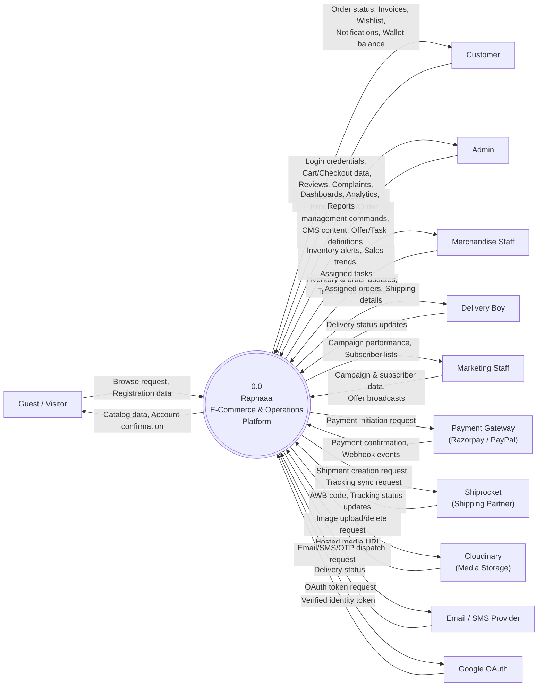
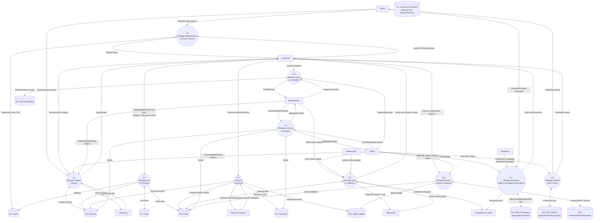
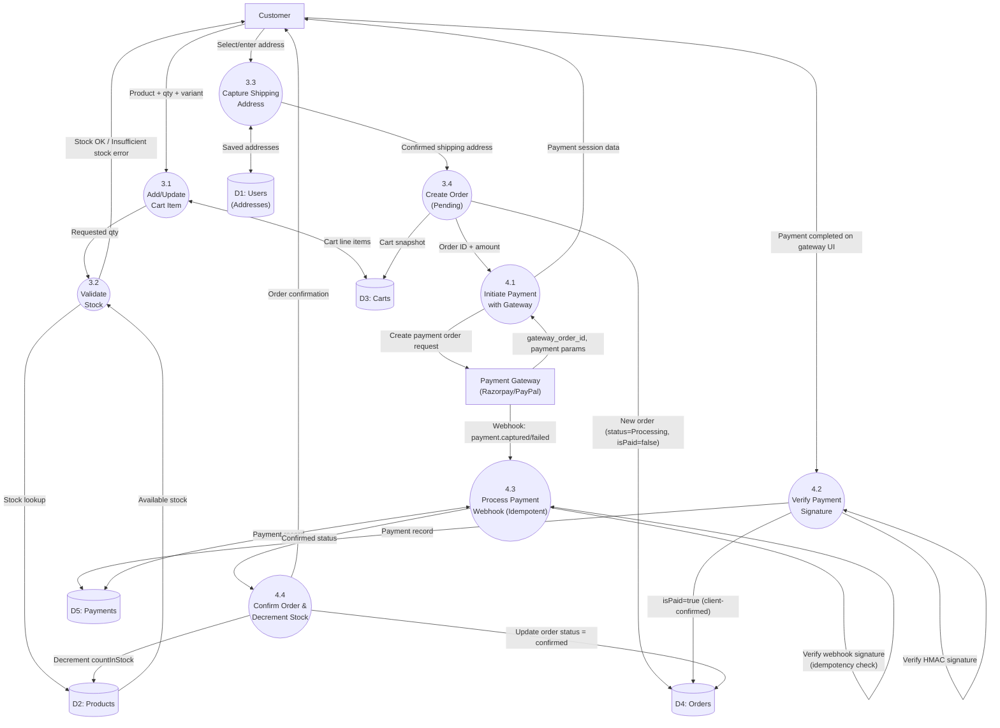
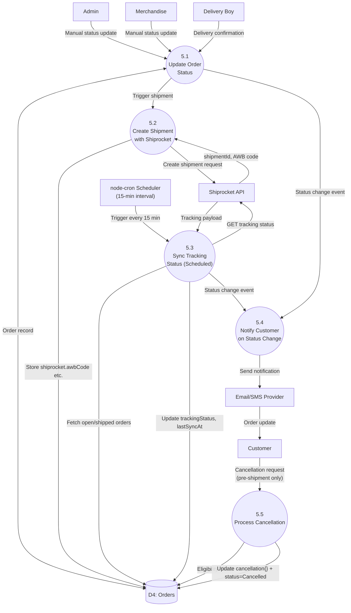
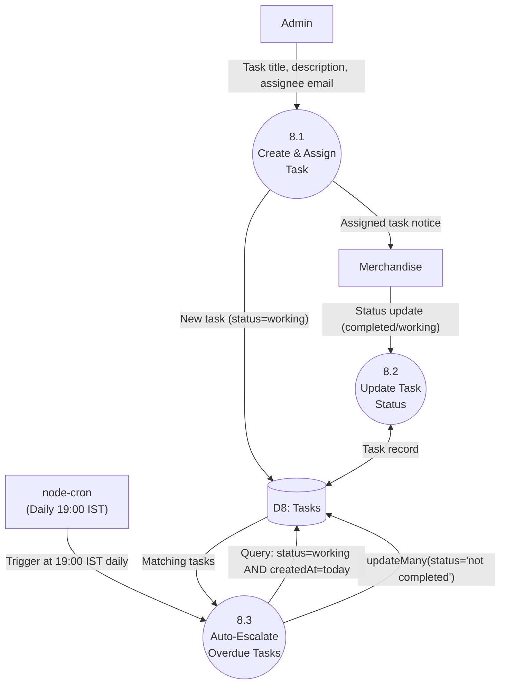

# DATA FLOW DIAGRAM (DFD)

## Raphaaa – Role-Based Full-Stack E-Commerce and Business Operations Platform

**Document Version:** 1.0
**Notation:** Gane–Sarson style (External Entity = rectangle, Process = rounded/circle numbered, Data Store = cylinder, Data Flow = labeled arrow), expressed as diagram-as-code using Mermaid.
**Prepared From:** Current codebase snapshot (`/backend` routes, controllers, models)
**Companion Documents:** `RAPHAAA_SYSTEM_DESIGN.md`, `RAPHAAA_SRS.md`, `RAPHAAA_FRS.md`

> **Rendering note:** All diagrams below are Mermaid `flowchart` code. They render natively in GitHub, GitLab, and VS Code (Markdown Preview Mermaid Support extension), or at https://mermaid.live.

---

## 1. Level 0 DFD — Context Diagram

The context diagram treats the entire Raphaaa platform as a single process and shows every external entity that exchanges data with it.

---

## 2. Level 1 DFD — Major Process Decomposition

The single context process is decomposed into 10 major processes, each backed by one or more data stores.

---

## 3. Level 2 DFD — Process 3.0 & 4.0: Cart, Checkout, and Payment (Drill-Down)

---

## 4. Level 2 DFD — Process 5.0: Order & Fulfilment Management (Drill-Down)

---

## 5. Level 2 DFD — Process 8.0: Task Management with Auto-Escalation (Drill-Down)

---

## 6. Data Store Dictionary

| ID | Data Store | Backing Model(s) | Key Contents |
|---|---|---|---|
| D1 | Users | `User.js` | Credentials (hashed), role, addresses, referral data, mobile/OTP verification state |
| D2 | Products | `Product.js` | Catalog details, price, stock, variants, images, SEO metadata |
| D3 | Carts | `Cart.js` | Per-user cart line items and computed totals |
| D4 | Orders | `Order.js`, `Checkout.js`, `Checkout1.js` | Order items, shipping address, payment method, status, Shiprocket tracking, cancellation/refund timeline |
| D5 | Payments | `payment.js` | Gateway transaction ID, status, amount, linked order |
| D6 | Offers/Campaigns/Subscribers/Contacts | `offer.js`, `campaignModel.js`, `Subscriber.js`, `Contact.js` | Promotion rules, campaign performance counters, subscriber/contact lists |
| D7 | Inventory & Analytics (derived) | Aggregated from `Product.js` + `Order.js` | Stock levels, low-stock flags, sales trend/revenue aggregates (no dedicated store — computed on read) |
| D8 | Tasks/Complaints | `taskModel.js`, `complaintModel.js` | Assignment, status, due/cutoff tracking |
| D9 | CMS Content | `Hero.js`, `HeroSlide.js`, `About.js`, `policyModel.js`, `Collab.js`, `ContactSetting.js` | Editable storefront content sections |
| D10 | Reviews/Return Requests | `Review.js`, `ReturnRequest.js`, `ProductQA.js` | Ratings, review text/images, return reason/status, product Q&A |
| D11 | Wallet Ledger | `WalletLedger.js` | Credit/debit entries, expiry dates, running balance |

## 7. Data Flow Dictionary (Selected Critical Flows)

| Flow | From → To | Description |
|---|---|---|
| Registration data | Guest → P1.0 | Name, email/mobile, password |
| Session token (JWT) | P1.0 → Customer | Signed token carrying user ID and role, used on all subsequent authenticated calls |
| Stock check | P3.2 → D2 | Read-only lookup of `countInStock` for requested variant before allowing checkout |
| Payment init request | P4.1 → Gateway | Amount, currency, order reference sent to Razorpay/PayPal to create a payable order |
| Webhook event | Gateway → P4.3 | Asynchronous, signed event (`payment.captured`, `payment.failed`) processed idempotently |
| Stock decrement | P4.4 → D2 | Applied exactly once, only after confirmed payment (client verification + webhook reconciliation) |
| Tracking sync request | P5.3 → Shiprocket | Polling request every 15 minutes for AWB status of open/shipped orders |
| Auto-escalation update | P8.3 → D8 | Bulk status update applied by the daily 19:00 IST cron job, without any external actor input |

---

## 8. Notes on Interpretation

- This DFD models **logical data movement**, not the physical REST endpoints (those are documented per-route in `RAPHAAA_FRS.md`).
- Processes 4.3 (Webhook) and 5.3/8.3 (Scheduler-driven) are **system-triggered**, not user-triggered — they appear because Raphaaa's architecture relies on asynchronous reconciliation (`node-cron`, `workers/jobWorker.js`) rather than purely synchronous request/response for payment confirmation and status escalation. This is a deliberate deviation from a "pure" user-driven DFD and reflects the actual codebase behavior in `server.js`.
- D7 (Inventory & Analytics) has no dedicated Mongoose model — it is intentionally shown as a derived/virtual data store computed at query time from Products and Orders, to avoid implying a persisted analytics table that does not exist in the schema.

---
**Document Type:** Data Flow Diagram (Gane–Sarson notation, Mermaid diagram-as-code)
**Project:** Raphaaa E-Commerce Platform
**Companion Documents:** `RAPHAAA_SYSTEM_DESIGN.md`, `RAPHAAA_SRS.md`, `RAPHAAA_FRS.md`, `RAPHAAA_PROJECT_SYNOPSIS.md`
