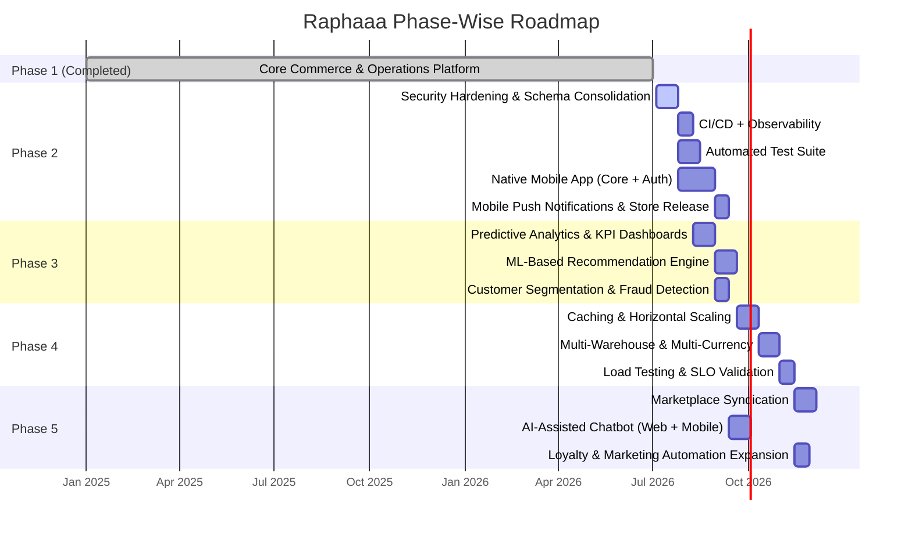
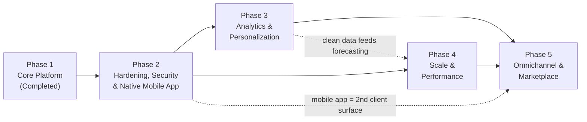

# PROJECT PHASE-WISE IMPLEMENTATION PLAN

## Raphaaa – Role-Based Full-Stack E-Commerce and Business Operations Platform

**Document Version:** 1.0
**Document Type:** Phase-Wise Implementation & Release Roadmap
**Baseline:** Current codebase snapshot (`/backend`, `/frontend`, `/ml`) = **Phase 1, Completed**
**Companion Documents:** `RAPHAAA_PROJECT_BLUEPRINT.md`, `RAPHAAA_SRS.md`, `RAPHAAA_FRS.md`, `RAPHAAA_SYSTEM_DESIGN.md`

> **Rendering note:** The Gantt chart in Section 9 is Mermaid code — renders on GitHub/GitLab/VS Code (Markdown Preview Mermaid Support) or at https://mermaid.live.

---

## 1. Purpose

This document divides the Raphaaa platform's lifecycle into **five sequential, professionally scoped phases**, following an incremental delivery model. **Phase 1 is the current, already-implemented state of the codebase** — every module verified present in `/backend` and `/frontend` today. Phases 2–5 are the forward roadmap, each scoped to be independently implementable, testable, and releasable without blocking the phases before or after it.

## 2. Phasing Methodology

- **Model:** Incremental/iterative delivery — each phase produces a shippable increment on top of a stable Phase 1 baseline, rather than a big-bang release.
- **Sequencing logic:** Phase order follows dependency and risk — technical debt and security hardening (Phase 2) are prioritized before adding analytics/intelligence (Phase 3), which is prioritized before scale-out infrastructure work (Phase 4), which precedes channel expansion (Phase 5).
- **Independence:** Each phase is scoped so a team could stop after any completed phase and still have a coherent, production-usable system.

---

## 3. Phase Summary Table

| Phase | Title | Status | Est. Duration | Primary Theme |
|---|---|---|---|---|
| **Phase 1** | Core Commerce & Operations Platform | ✅ **Completed (Current State)** | — | Deliver the full storefront + role-based operations baseline |
| **Phase 2** | Platform Hardening, Security & Native Mobile App | 🔜 Planned | 8–10 weeks | Close known gaps, consolidate schema debt, add observability, ship the native mobile app |
| **Phase 3** | Advanced Analytics, Intelligence & Personalization | 🔜 Planned | 6–8 weeks | Predictive analytics, ML-based recommendations, segmentation |
| **Phase 4** | Scale, Performance & Multi-Region Readiness | 🔜 Planned | 6–8 weeks | Caching, load handling, multi-warehouse/multi-currency |
| **Phase 5** | Omnichannel & Marketplace Expansion | 🔜 Planned | 6–8 weeks | Marketplace sync, AI-assisted chatbot, loyalty expansion |

> **Change note (v1.1):** Native mobile app development has been moved from Phase 5 to Phase 2, at the user's request, so the mobile channel launches earlier and benefits directly from Phase 2's security hardening (rate limiting, auth middleware fixes) rather than shipping against an unhardened API. Phase 5 has been re-scoped accordingly.

---

## 4. Phase 1 — Core Commerce & Operations Platform *(Completed — Current Baseline)*

### 4.1 Objective
Establish a fully functional, role-based e-commerce platform covering the complete customer journey and internal operational tooling, as verified in the current codebase.

### 4.2 Delivered Scope
- **Storefront:** catalog with search/filter, product detail with variants and size charts, cart, wishlist, checkout, Razorpay/PayPal/COD payment, order tracking, reviews & product Q&A, return requests.
- **Authentication:** JWT sessions, Bcrypt hashing, Google OAuth, OTP verification, password reset.
- **Operations:** product/order/user management, inventory monitoring, sales trend & revenue dashboards, task management with automated daily escalation.
- **Marketing:** rule-based offer engine (conditions/benefits, priority, stacking), campaign click/impression/conversion tracking, subscriber and contact management.
- **Platform services:** wallet ledger with expiry, referral system, website CMS (Hero/About/Contact/Policy/Collab), Cloudinary media pipeline, Shiprocket shipment creation and tracking sync, background job queue/worker, basic chatbot UI component.

### 4.3 Exit Criteria (met)
- All 6 roles (Guest, Customer, Admin, Merchandise, Delivery Boy, Marketing) have functioning, access-controlled interfaces.
- End-to-end payment reconciliation (client verification + webhook) is idempotent and functional.
- 28 MongoDB collections are live with documented schemas (`RAPHAAA_DATABASE_STRUCTURE.md`).

### 4.4 Known Carry-Forward Items (feed into Phase 2)
- Some CMS/settings routes lack explicit auth middleware.
- `Checkout` and `Checkout1` are near-duplicate schemas.
- `Product` carries both legacy `variants[]` and current `colorVariants[]` structures.

---

## 5. Phase 2 — Platform Hardening, Security & Native Mobile App

### 5.1 Objective
Close the security and schema gaps identified during Phase 1, establish the observability/testing discipline needed before adding new complexity, **and launch the native mobile app** on top of the existing REST API — brought forward from the original Phase 5 slot at the user's request so the mobile channel ships earlier.

### 5.2 Entry Criteria
Phase 1 deployed and stable in production; known-issues list from `RAPHAAA_SRS.md` Appendix C and `RAPHAAA_DATABASE_STRUCTURE.md` §9 available; core REST API surface (`/api/*`) considered feature-complete for read/write commerce flows.

### 5.3 Scope & Deliverables

**Track A — Hardening & Technical Debt** (prerequisite for Track B, run first/in parallel):
| Deliverable | Description |
|---|---|
| Middleware hardening | Add explicit `protect`/role middleware to all CMS/settings routes currently unprotected |
| Schema consolidation | Merge `Checkout` and `Checkout1` into a single schema; migrate legacy `variants[]` fully into `colorVariants[]` |
| Automated test suite | Unit tests for controllers/services (order, payment, wallet); integration tests for Razorpay/webhook and Shiprocket flows |
| CI/CD pipeline | Automated lint/test/build gate on PRs; environment-specific deploy pipelines for Vercel/Render |
| Observability | Structured request logging (building on existing `requestTracing` middleware), error tracking/alerting, job-queue failure dashboards |
| Audit logging | Track admin/merchandise actions on orders, products, and users for accountability |
| Rate limiting & abuse protection | Apply to auth, OTP, and public tracking-pixel endpoints — critical before exposing the API to a public mobile client |

**Track B — Native Mobile Application** (depends on Track A's auth/rate-limiting hardening):
| Deliverable | Description |
|---|---|
| Mobile app foundation | iOS/Android app (e.g., React Native, reusing the team's existing React/Redux Toolkit expertise) consuming the existing `/api/*` routes |
| Mobile authentication | JWT login, Google OAuth, OTP verification flows adapted to mobile UX |
| Core commerce parity | Catalog browsing, cart, wishlist, checkout, Razorpay/PayPal/COD payment, order tracking, reviews — parity with the web storefront |
| Push notifications | Native push (extending the existing `pushSubscription`/web-push scaffolding in `User`/`Subscriber` models) for order status and offers |
| App store release | Beta submission and release to Google Play / Apple App Store |

### 5.4 Exit Criteria
- Zero unauthenticated write access to CMS/settings routes.
- Single canonical Checkout schema and single canonical Product variant structure in use.
- CI pipeline blocks merges on failing tests; staging deploy is automated.
- Native mobile app live in at least one app store (beta or production), with commerce parity to the web storefront and functioning push notifications.

### 5.5 Dependencies
Track A requires Phase 1's job worker and middleware infrastructure as the base to extend (no new infra class introduced). Track B (mobile) depends on Track A's rate-limiting/auth hardening being in place before the API is exposed to a public mobile client, but can otherwise be staffed and developed in parallel with Track A.

---

## 6. Phase 3 — Advanced Analytics, Intelligence & Personalization

### 6.1 Objective
Move from descriptive reporting (Phase 1's sales trend/revenue dashboards) to predictive and personalized capabilities.

### 6.2 Entry Criteria
Phase 2's observability and clean schema in place (analytics quality depends on consolidated, well-instrumented data).

### 6.3 Scope & Deliverables
| Deliverable | Description |
|---|---|
| Predictive sales analytics | Demand forecasting per category/SKU using historical `Order`/`Product` data |
| Enhanced KPI dashboards | Cohort retention, customer lifetime value, campaign ROI (extending `Campaign.ctr`/`conversionRate` virtuals) |
| ML-based product recommendations | Replace the current catalog/rule-based `recommendationRoutes` logic with a trained model (collaborative/content-based filtering), potentially reviving the `/ml/recommender` component |
| Customer segmentation | Behavioral segments feeding targeted offers (`Offer.conditions`) and marketing broadcasts |
| Fraud/anomaly detection | Flag suspicious payment or return-request patterns for Admin review |
| Smarter alerting | Extend `alertService` (back-in-stock/price-drop) with personalized relevance scoring |

### 6.4 Exit Criteria
- Recommendation module served from a trained model with measurable lift over the rule-based baseline.
- Predictive sales dashboard available to Admin/Merchandise roles.

### 6.5 Dependencies
Consumes clean, consolidated data from Phase 2; may introduce a Python-based ML service alongside the existing `ml/recommender` scaffold.

---

## 7. Phase 4 — Scale, Performance & Multi-Region Readiness

### 7.1 Objective
Prepare the platform for higher transaction volume, additional warehouses, and international operation.

### 7.2 Entry Criteria
Analytics baseline (Phase 3) available to validate performance improvements against real usage patterns.

### 7.3 Scope & Deliverables
| Deliverable | Description |
|---|---|
| Caching layer | Introduce Redis (or equivalent) for catalog/session-adjacent hot paths, reducing MongoDB read load |
| Horizontal scaling | Containerize the Express API; validate stateless JWT design under multi-instance load |
| Multi-warehouse inventory | Extend `Product`/`Order` schema to support stock and fulfilment per warehouse location |
| Multi-currency support | Extend pricing (`pricingService`) and checkout to handle currency selection beyond INR/Razorpay |
| Expanded courier integration | Add couriers beyond Shiprocket for redundancy and international shipping |
| Load & performance testing | Establish baseline throughput/latency SLOs and load-test the checkout/payment path |

### 7.4 Exit Criteria
- System sustains defined peak-load SLOs (throughput/latency) in load testing.
- At least one additional warehouse and one additional currency operate end-to-end in staging.

### 7.5 Dependencies
Builds on the hardened, tested codebase from Phase 2; benefits from analytics (Phase 3) to identify real hot paths worth caching.

---

## 8. Phase 5 — Omnichannel & Marketplace Expansion

### 8.1 Objective
Extend Raphaaa beyond the web storefront and the Phase 2 mobile app into additional customer touchpoints and channels, reusing the existing (now scaled) REST API surface.

### 8.2 Entry Criteria
Stable, scaled API (Phase 4) capable of serving additional client types without redesign; native mobile app (Phase 2) live and stable, providing a second reference client alongside web.

### 8.3 Scope & Deliverables
| Deliverable | Description |
|---|---|
| Marketplace syndication | Sync catalog/orders with Amazon/Flipkart/Meesho (building on the existing `Product.externalOffers` comparison fields) |
| AI-assisted chatbot | Upgrade the current `Chatbot.jsx` UI shell into an LLM-backed assistant for order status, product Q&A, and support triage — deployed to both web and the Phase 2 mobile app |
| Loyalty/referral expansion | Deepen the existing wallet/referral system into tiered loyalty rewards |
| Expanded marketing automation | Multi-channel (SMS + push + email) campaign orchestration beyond current email-only broadcast |

### 8.4 Exit Criteria
- At least one marketplace channel syncing catalog and order status bidirectionally.
- LLM-assisted chatbot live on web and mobile with measurable support-ticket deflection.

### 8.5 Dependencies
Requires the scaled, multi-currency-capable API from Phase 4 to support additional channels without re-architecture, and the Phase 2 mobile app as a second client surface for the chatbot and loyalty features.

---

## 9. Phase Timeline (Gantt Overview)

*(Durations are planning estimates for scoping purposes, not committed delivery dates.)*

---

## 10. Cross-Phase Dependency Map

---

## 11. Governance & Phase-Exit Checklist

Each phase is considered closed only when:
1. All listed deliverables are merged and deployed to staging.
2. Exit criteria (Sections 4.3, 5.4, 6.4, 7.4, 8.4) are verified.
3. Companion documentation (`RAPHAAA_SRS.md`, `RAPHAAA_FRS.md`, `RAPHAAA_SYSTEM_DESIGN.md`, `RAPHAAA_DATABASE_STRUCTURE.md`) is updated to reflect the new state, so the "current baseline" definition used by the next phase stays accurate.
4. No open high-severity item from the phase's own scope remains unresolved (carry-forwards must be explicitly logged, as done for Phase 1 → Phase 2 in §4.4).

---

## 12. Risk Summary by Phase

| Phase | Key Risk | Mitigation |
|---|---|---|
| Phase 2 | Schema migration (Checkout/variant consolidation) breaks existing orders/products | Write and test a backward-compatible migration script; run in staging against a production data snapshot first |
| Phase 2 | Mobile app ships against an API that isn't yet rate-limited/hardened, exposing new abuse surface (e.g., OTP/auth endpoints hit from a public app binary) | Sequence Track A (hardening, rate limiting) ahead of/parallel to Track B (mobile), and gate mobile's public release on Track A's exit criteria being met first |
| Phase 2 | Maintaining two client surfaces (web + mobile) against one API increases regression risk on shared endpoints | Extend the Phase 2 automated test suite to cover contract tests for both client types before app store release |
| Phase 3 | ML recommendation model underperforms rule-based baseline | Ship behind a feature flag; A/B test against Phase 1's existing catalog-based logic before full cutover |
| Phase 4 | Multi-warehouse/currency changes introduce checkout regressions | Extensive regression testing on the checkout/payment path (highest-risk flow per `RAPHAAA_FRS.md` §FR-GROUP-08/09) |
| Phase 5 | Marketplace syndication creates data sync conflicts (stock oversell across channels) | Centralize stock decrement logic in the existing webhook-reconciliation pattern; treat Raphaaa DB as source of truth |

---
**Document Type:** Phase-Wise Implementation & Release Roadmap
**Project:** Raphaaa E-Commerce Platform
**Companion Documents:** `RAPHAAA_PROJECT_BLUEPRINT.md`, `RAPHAAA_SRS.md`, `RAPHAAA_FRS.md`, `RAPHAAA_SYSTEM_DESIGN.md`, `RAPHAAA_DFD.md`, `RAPHAAA_DATABASE_STRUCTURE.md`
