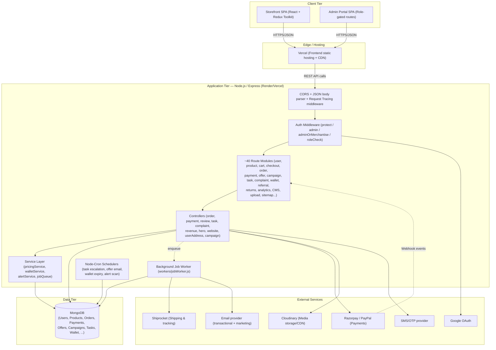
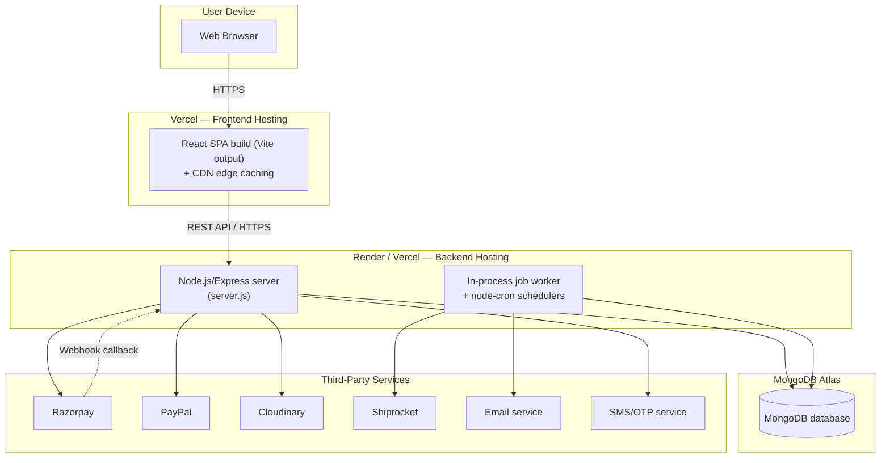
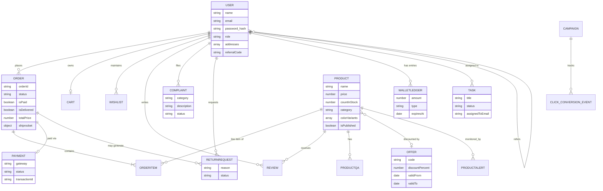
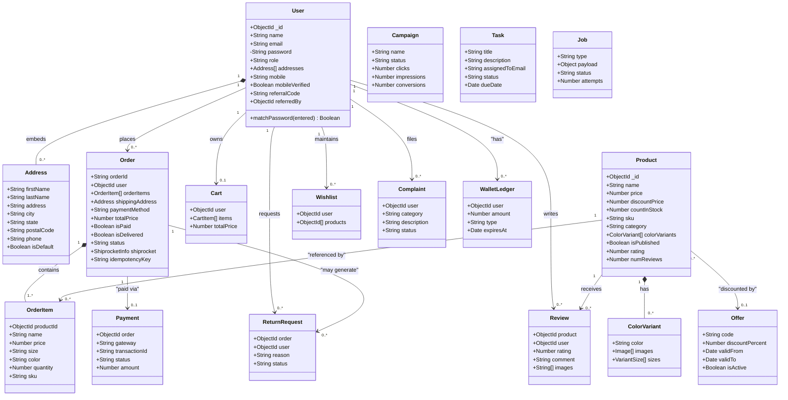
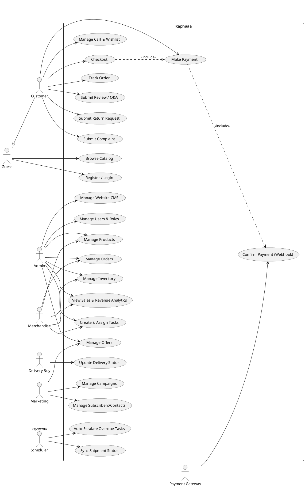
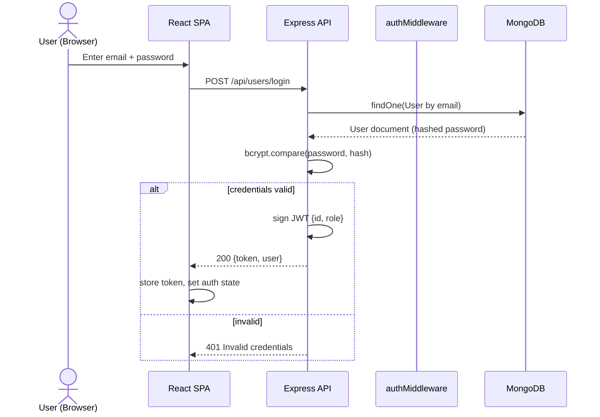
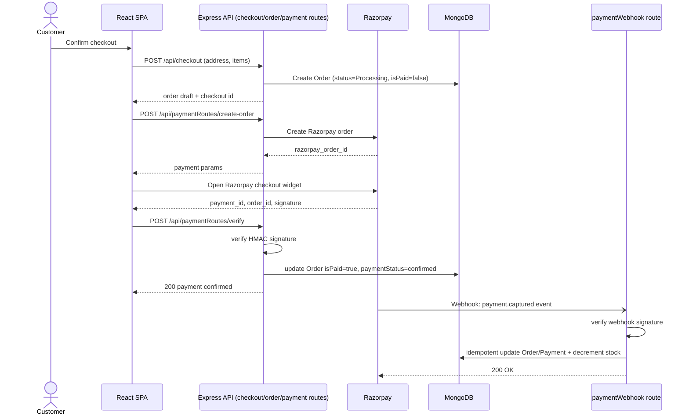
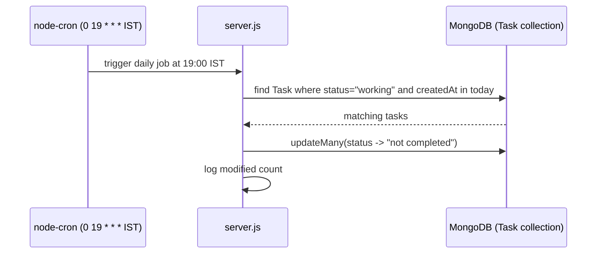
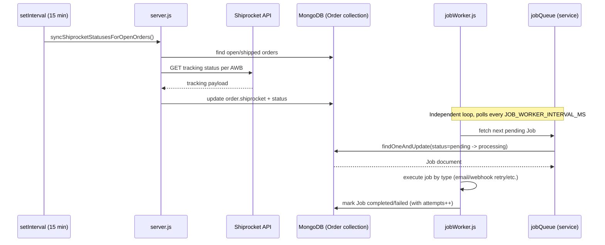

# SYSTEM DESIGN & ARCHITECTURE DOCUMENT

## Raphaaa – Role-Based Full-Stack E-Commerce and Business Operations Platform

**Document Version:** 1.0
**Prepared From:** Current codebase snapshot (`/backend`, `/frontend`, `/ml`)
**Companion Documents:** `RAPHAAA_SRS.md`, `RAPHAAA_FRS.md`, `RAPHAAA_PROJECT_SYNOPSIS.md`

> **Rendering note:** Diagrams marked `mermaid` render natively in GitHub, GitLab, and VS Code (Markdown Preview Mermaid Support extension). Diagrams marked `plantuml` need a PlantUML renderer (VS Code "PlantUML" extension, or https://www.plantuml.com/plantuml — paste the code block content).

---

## 1. Architecture Style

Raphaaa is a **monolithic, layered, three-tier web application** (not microservices) with one asynchronous background worker split out of the request/response cycle:

- **Client tier:** React SPA (storefront + role-gated admin portal), calling a single REST API.
- **Application tier:** Express.js server exposing ~40 route modules, each following Route → Middleware (auth/role) → Controller → Service/Model.
- **Data tier:** MongoDB via Mongoose.
- **Asynchronous tier:** an in-process job worker (`workers/jobWorker.js`) plus `node-cron` scheduled tasks, decoupling slow/unreliable operations (emails, webhooks, Shiprocket sync, wallet expiry, alert scanning) from the HTTP request path.

This style was chosen (per the codebase) for simplicity of deployment (single Node process + single React build) while still isolating slow/retryable work via a lightweight internal job queue rather than a full message broker.

---

## 2. High-Level Architecture Diagram

---

## 3. Component Diagram (Backend Internal Layering)

```mermaid
flowchart LR
    subgraph RouteLayer["Route Layer"]
        R1[userRoutes]
        R2[productRoutes]
        R3[cartRoutes / checkoutRoutes]
        R4[orderRoutes / adminOrderRoutes]
        R5[paymentRoutes / paymentWebhook]
        R6["offerRoutes / campaignRoutes"]
        R7["taskRoutes / complaintRoutes / returnRequestRoutes"]
        R8["walletRoutes / referralRoutes / alertRoutes"]
        R9["analyticsRoutes / salesRoutes / inventoryRoutes"]
        R10["CMS routes: heroRoutes, aboutRoutes,\ncontactSettingRoutes, policyRoutes, collabRoutes"]
    end

    subgraph MiddlewareLayer["Middleware Layer"]
        M1["authMiddleware\n(protect, admin, adminOrMerchantise, roleCheck)"]
        M2[uploadMiddleware]
        M3[requestTracing]
    end

    subgraph ControllerLayer["Controller Layer"]
        CT1[orderController]
        CT2[paymentController]
        CT3[reviewController]
        CT4[taskController]
        CT5[complaintController]
        CT6[revenueController]
        CT7["heroController / websiteController"]
        CT8[campaignController]
        CT9[userAddressController]
    end

    subgraph ServiceLayer["Service Layer"]
        S1[pricingService]
        S2[walletService]
        S3[alertService]
        S4[jobQueue]
    end

    subgraph ModelLayer["Model Layer (Mongoose Schemas)"]
        MD1["User / Product / Order / Payment"]
        MD2["Offer / Campaign / Task / Complaint"]
        MD3["ReturnRequest / WalletLedger / Job"]
        MD4["Hero / About / Policy / Collab / SizeChart / MetaOption"]
    end

    subgraph ConfigLayer["Config Layer"]
        CFG1[db.js]
        CFG2[cloudinary.js]
        CFG3[razorpay.js]
        CFG4[multer.js]
        CFG5[shippingZones.js]
    end

    RouteLayer --> MiddlewareLayer --> ControllerLayer
    ControllerLayer --> ServiceLayer
    ControllerLayer --> ModelLayer
    ServiceLayer --> ModelLayer
    ControllerLayer --> ConfigLayer
    ServiceLayer --> ConfigLayer
```

---

## 4. Deployment Diagram

---

## 5. Database Design — Entity Relationship Diagram

---

## 6. UML Class Diagram (Core Domain Model)

---

## 7. UML Use Case Diagram

---

## 8. UML Sequence Diagrams — Key Flows

### 8.1 Authentication (Login)

### 8.2 Checkout → Payment → Webhook Reconciliation

### 8.3 Scheduled Task Auto-Escalation (node-cron)

### 8.4 Background Job Worker + Shiprocket Sync

---

## 9. Design Patterns & Architectural Notes

| Pattern / Technique | Where Used | Purpose |
|---|---|---|
| **Layered architecture** (Route → Middleware → Controller → Service → Model) | Entire backend | Separation of concerns; each route module stays thin. |
| **Middleware chain** | `authMiddleware`, `requestTracing`, `uploadMiddleware`, CORS | Cross-cutting concerns (auth, logging, file handling) applied declaratively per route. |
| **Stateless authentication (JWT)** | `authMiddleware`, all protected routes | Enables horizontal scaling without server-side session storage. |
| **Producer/Consumer job queue** | `services/jobQueue.js` + `workers/jobWorker.js` | Decouples slow/retryable operations (emails, webhook side-effects) from the request/response cycle; supports retry via `attempts` counter. |
| **Scheduler (cron) pattern** | `node-cron` jobs in `server.js` (task escalation, wallet expiry, alert scan, offer email) | Time-based automation independent of user requests. |
| **Idempotency key** | `Order.idempotencyKey`, webhook signature verification | Prevents duplicate order creation/payment processing on retries. |
| **Active Record via Mongoose** | All `models/*.js` | Schema validation and instance methods (e.g., `User.matchPassword`) co-located with the data model. |
| **Facade/Config isolation** | `config/db.js`, `config/cloudinary.js`, `config/razorpay.js`, `config/shippingZones.js` | Isolates third-party SDK setup from business logic, easing credential/env management. |
| **Role-Based Access Control (RBAC)** | `authMiddleware.roleCheck(...)`, frontend protected routes | Enforced server-side as the source of truth; frontend guarding is UX-only. |

---

## 10. How to Regenerate These Diagrams

- **Mermaid** blocks: render directly on GitHub/GitLab, or in VS Code with the "Markdown Preview Mermaid Support" extension, or paste into https://mermaid.live.
- **PlantUML** block (Section 7): render via the VS Code "PlantUML" extension, or paste into https://www.plantuml.com/plantuml/uml/.
- Diagrams are derived from the current schema/route snapshot; regenerate after any model or route-level change.

---
**Document Type:** System Design & Architecture Document (with UML)
**Project:** Raphaaa E-Commerce Platform
**Companion Documents:** `RAPHAAA_SRS.md`, `RAPHAAA_FRS.md`, `RAPHAAA_PROJECT_SYNOPSIS.md`, `RAPHAAA_FUNCTIONAL_DOCUMENTATION.md`
